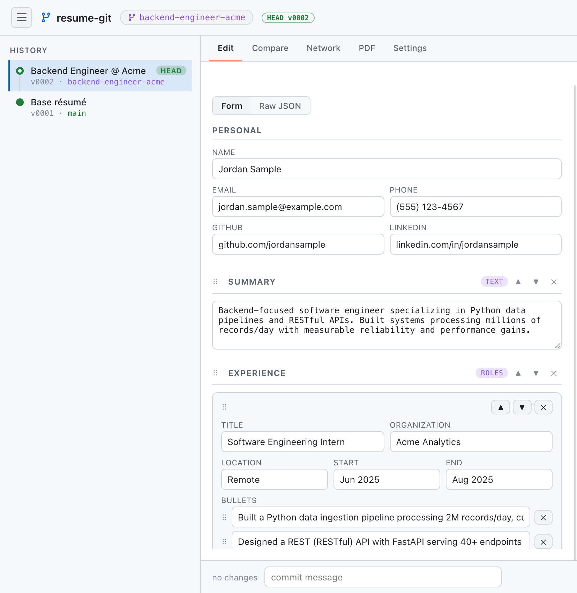
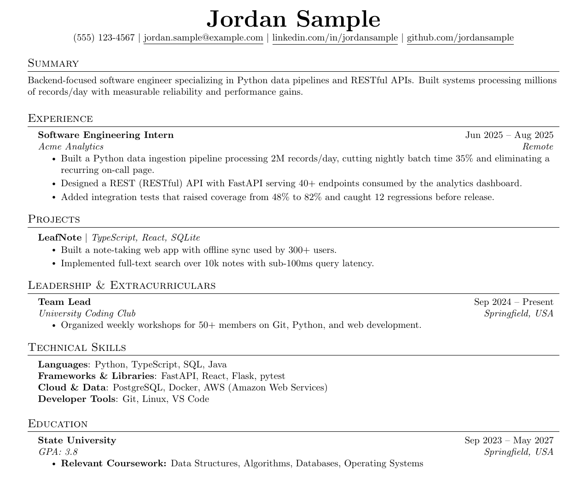
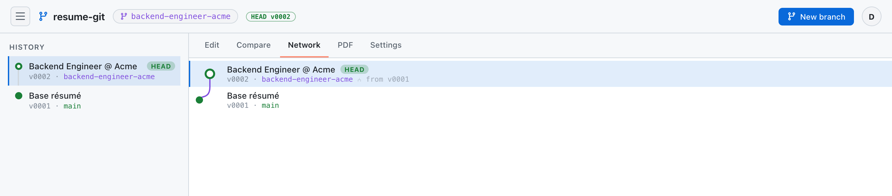
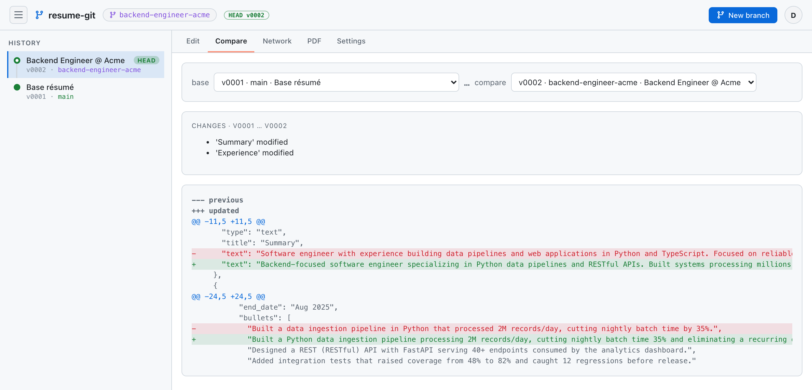

# Resume Manager

**Live at [resume.kosmoskit.com](https://resume.kosmoskit.com)**

A small web app for managing a resume with full version history, diffing, AI
tailoring, and one-click PDF compilation. JSON is the single source of truth; a
LaTeX (Jake's-Resume) template renders it to an ATS-friendly one-page PDF.

Supports **open self-serve signup**: anyone can sign in with Google and use it
(per-user isolated). The app does its own auth: **Google OAuth** for sign-in and a
signed session cookie, so it needs no login gate in front of it. It deploys on a
self-hosted [console](https://github.com/Sam-Stuhl/console) PaaS. In-app guardrails
(a signup cap, per-user storage/rate limits) keep the open door safe (see
**Deploying** below).

## Screenshots

<table>
  <tr>
    <td width="52%" valign="top"><br><sub><b>Structured editor.</b> Typed sections plus a git-style history rail.</sub></td>
    <td width="48%" valign="top"><br><sub><b>Compiled PDF.</b> One-page, ATS-friendly, rendered on demand.</sub></td>
  </tr>
</table>

Branch and tailor for a job (tailored versions fork from your base):



Compare any two versions as a PR-style diff before you commit:



## Two kinds of changes

- **Base updates**: facts about your life change (new role, new school,
  finished a project). These update *who you are* and become the new canonical
  baseline. Future tailoring starts from the latest base.
- **Tailoring**: a job-specific *presentation* of your background. Tailored
  versions fork from the current base and never become the new base.

Nothing is ever overwritten: every save is a new version, and you can restore
any past one (non-destructively).

## Resume Assistant

A curated, streaming AI assistant that operates the repo like git. It reads your
version history (list / view / diff), proposes résumé changes you review as a
diff and apply (or open as a branch) and can check out / restore versions with
confirmation (approving executes the action and the assistant keeps going).
Four `/`-invokable **skills**, each scoped to only the tools it needs:

- `/ask`: honest advice (read-only)
- `/ats`: audit a version against a job description (read-only)
- `/tailor`: adapt your résumé to a job and open it as a branch
- `/base-update`: incorporate a real life change into the baseline

Bring your own credential in **Settings**: a Claude **API key** (`sk-ant-api…`,
bills API credits) or a **Claude Code OAuth token** (`sk-ant-oat…`, from
`claude setup-token`, bills your Claude subscription), auto-detected, and both
work for in-app tailoring.

Without a key, the **copy-paste assistant** is a first-class path, not a fallback:
pick an intent (ask / ATS / tailor / base-update), copy a ready-made prompt (the
JD or life-change already injected) into any Claude.ai chat, and paste the reply
back. Content changes are fence-stripped, schema-validated, and shown as a diff
before anything commits. A brand-new account is walked through a first-run wizard
that can even **bootstrap a base résumé from pasted text with no key at all**.
Design intent for the whole app is captured in `PRODUCT.md` and `DESIGN.md`.

## Architecture

| Layer | Tech |
|-------|------|
| Core | Pure Python (`core/`): LaTeX render, PDF compile, diff, schema, prompts, AI |
| Backend | FastAPI (`api/`) + SQLAlchemy async (`db/`), reusing `core/` |
| Frontend | React + Vite + TypeScript SPA (`frontend/`), served by the backend in prod |
| Data | Postgres (Neon) in prod, SQLite locally, resume JSON stored in-row; **PDFs compiled on demand**, never stored |
| Auth | The app's own: **Google OAuth** sign-in + a signed session cookie (JWT, httpOnly/Secure/SameSite). Stateless, so it survives the ephemeral-container redeploys. All data is per-user (scoped by `user_id`); a `MAX_USERS` cap guards signup |
| AI | **Resume Assistant**: a git-aware agent (streaming tool loop over the Claude Messages API); per-user API key *or* Claude Code OAuth token. Copy-paste prompt fallback otherwise |

## Local development

```bash
# Backend
python3 -m venv .venv && source .venv/bin/activate
pip install fastapi "uvicorn[standard]" "sqlalchemy[asyncio]" aiosqlite httpx "pyjwt[crypto]" anthropic
cp .env.example .env                     # DEV_USER_EMAIL impersonates a user (bypasses Google sign-in)
DEV_USER_EMAIL=dev@example.com uvicorn api.main:app --reload --port 8080

# Frontend (separate terminal). Vite proxies /api to :8080
cd frontend && npm install && npm run dev   # http://localhost:5173
```

Requires `pdflatex` on PATH for PDF compilation
(`brew install --cask mactex-no-gui`, or `texlive-latex-recommended` on Linux).

Run the tests with `pytest` (the PDF test auto-skips if `pdflatex` is absent).

## Deploying on `console`

1. Create a Postgres project (Neon); note the connection string.
2. Create a **Google OAuth 2.0 Web client** (Google Cloud console → APIs & Services
   → Credentials). Add the authorized redirect URI
   `https://<your-domain>/api/auth/google/callback` (it must match `APP_BASE_URL`
   below exactly, with no trailing slash). Note the client id + secret.
3. Register the project in the console and set the secrets:
   - `DATABASE_URL`: the Postgres connection string.
   - `SESSION_SECRET`: a random 32+ byte string signing the session cookie
     (`openssl rand -base64 48`).
   - `GOOGLE_CLIENT_ID` / `GOOGLE_CLIENT_SECRET`: from step 2.
   And the env (non-secret): `APP_BASE_URL=https://<your-domain>` (builds the
   redirect URI and enables Secure cookies; this is the single source of truth for
   the public origin, so no domain is hardcoded in the app). Optional guardrails: `MAX_USERS`,
   `MAX_VERSIONS_PER_USER`, `COMPILE_RATE_PER_MIN`, `CHAT_RATE_PER_MIN`. Never set
   `DEV_USER_EMAIL` in production (it bypasses auth).
4. Copy `deploy.yml` to `.github/workflows/deploy.yml`. Push to `main`: GitHub
   Actions builds the image (Dockerfile bundles a minimal TeX distro and runs a
   PDF smoke test), and the console pulls and deploys it.
5. One-time: import your existing CLI data:
   `DATABASE_URL=<url> python migrate_import.py you@example.com`.

## Importing from the CLI

The legacy CLI's version history transfers in via a bundle file (no DB URL or
Python env needed on the web side):

```bash
python export_cli.py          # reads resume_data/, writes resume_export.json
```

Then in the web app open **Settings → Import from CLI** (or the Import panel
shown when the account is empty) and upload `resume_export.json`. Every version
comes across with its labels, base/tailor flags, fork lineage, and the current
pointer. (Alternatively, `migrate_import.py` writes straight to Postgres.)

## Résumé JSON (section model)

A résumé is a header plus an ordered list of **typed sections**, not a fixed set
of keys, so sections can be added, reordered, and renamed freely:

```json
{
  "personal": { "name", "email", "phone", "github", "linkedin" },
  "sections": [
    { "type": "text",      "title": "Summary",    "text": "..." },
    { "type": "roles",     "title": "Experience", "entries": [ { "title", "organization", "location", "start_date", "end_date", "bullets": [] } ] },
    { "type": "projects",  "title": "Projects",   "entries": [ { "name", "stack", "bullets": [] } ] },
    { "type": "skills",    "title": "Skills",     "groups":  [ { "category", "items" } ] },
    { "type": "education", "title": "Education",  "entries": [ { "school", "location", "gpa", "start_date", "end_date", "coursework" } ] },
    { "type": "bullets",   "title": "Awards",     "items":   [ "..." ] }
  ]
}
```

Section types: `text`, `roles`, `projects`, `skills`, `education`, `bullets`
(see `core/sections.py`). Legacy fixed-schema data (the old
`summary`/`experience`/… keys) is upgraded to this model automatically on read,
so existing versions keep working and render byte-identically.

## Privacy

This is a **public, code-only** repo. All personal data (`resume_data/`, PDFs,
the SQLite DB, the personal work log) is gitignored. Sample data lives in
`samples/sample_resume.json` (fictional). Secrets are never committed: they are
set as console secrets or a local `.env`.

## Legacy CLI

The original single-file interactive console (`resume.py`) still runs
standalone (`python resume.py`) against a local `resume_data/` folder. The web
app supersedes it; the shared logic now lives in `core/`.
